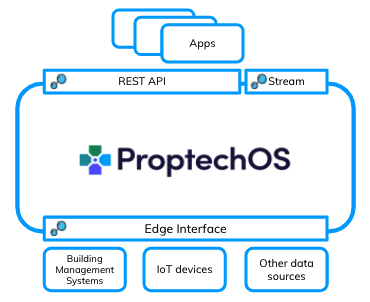

  

# ProptechOS Developer Documents

[Develop apps for ProptechOS](https://proptechos.com/)  
For examples, see our separate `examples` repo [github.com/idun-corp/Idun-Examples](https://github.com/idun-corp/Idun-Examples)

## API
The streaming API lets you explore and edit the knowledge graph, query telemetry and execute actuations.  
[Consuming Idun ProptechOS REST API](ProptechOS-Api)

### Service Object API
[Using the Service Object API](ProptechOS-Service-Object)

## Streaming API
The streaming API lets you consume telemetry.  
[Consuming Idun ProptechOS Streaming API](ProptechOS-Streaming-Api)

### Delta Stream
[Consume the twin delta stream](ProptechOS-Delta-Stream)

## Edge Interface
Learn about Edge integrations with the [Idun Edge Interface and sample Connector](ProptechOS-Edge-Interface).  
ProptechOS uses [RealEstateCore Edge messages](https://github.com/RealEstateCore/rec/tree/master/api/edge_messages) and is implemented using [Microsoft Azure IoT Hub](https://azure.microsoft.com/en-us/services/iot-hub/)

## RealEstateCore
Link to the documentation, guides, and examples for RealEstateCore development: [RealEstateCore SDK](dev.realestatecore.io)

## Contribute

Read our [Contributing guidance](CONTRIBUTING.md).

Contributing to the documentation requires a GitHub account. If you don't have an account, follow the instructions for the [GitHub account setup](https://docs.github.com/en/get-started/onboarding/getting-started-with-your-github-account) from GitHub documentation page.

## License

Please refer to [LICENSE](LICENSE) and [ThirdPartyNotices](ThirdPartyNotices.md) for all Licensing information.
