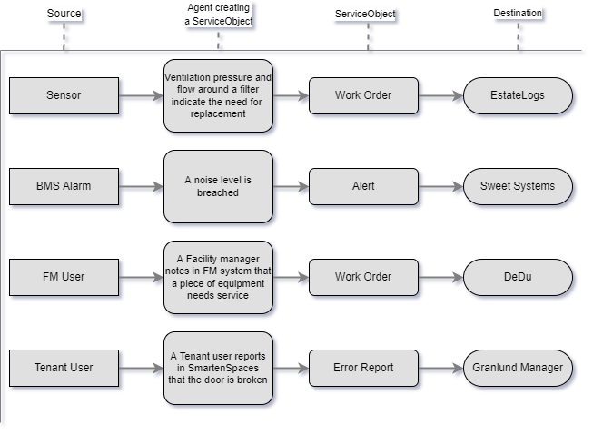
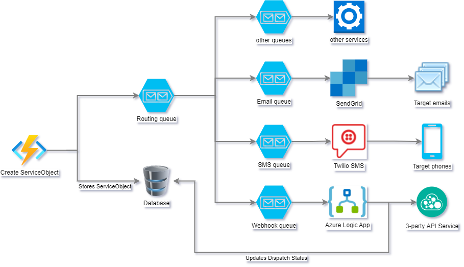

# ServiceObject API User Guide

RealEstateCore and P8S ServiceObject - Alarm, Alert and Work Order model that aggregates different types of events and activities into a single set of APIs with **publish–subscribe** pattern.

## System Overview

### Data flow diagram

ServiceObject could be produced from different applications or users and depending on type of event ServiceObject could be consumed by multiple 3-party services.



### ServiceObject consumption overview


There are 4 entities in the application

### ServiceObject

ServiceObject is the main actor. ServiceObject could be produced directly via
API or by configured alert based on sensor observation stream. Read more
about [ProptechOS Alerts](/proptechOS/alerts/README.md)

### Route

Routes provide the ability to specify which service objects should be dispatched by selected dispatchers. Therefore, the dispatcher itself is configured once with required/sensitive information, and then routing is responsible for leveraging how many service objects should be dispatched. Routing can be updated multiple times without the need to re-configure dispatcher information.

### Dispatcher

Dispatchers introduce an abstraction layer on top of the existing ServiceObject stream that allows to dispatch items to 3-party systems: Email, SMS, EstateLogs, Webhook etc. Dispatcher aggregates information about how to dispatch specific ServiceObject and stores any sensitive information: API keys, credentials, etc., so applications that produce ServiceObject don't need to know nor provide this information during ServiceObject creation.

Some dispatchers are provided by ProptechOS as a service: Email, SMS, so clients don't need to have their Email/SMS integration services. Other dispatchers will require sensitive information provided by clients like EstateLogs service credentials, those will be stored securely and used only during the dispatching process.

#### Dispatcher types

ServiceObject API develops integration with different dispatcher types and the list of supported types will grow in the future. Clients that want to create an instance of a dispatcher have to submit a request with required information depending on the type of the dispatcher and then set up routing for ServiceObjects that will instruct the dispatcher which service objects should be dispatched by them. One ServiceObject could be dispatched by multiple dispatchers and a single dispatcher can dispatch multiple service objects.

### Dispatch Log

Dispatch Log contains the information about the ServiceObject dispatching.
Whenever ServiceObject is processed by Router, each dispatcher creates
a log entry with dispatch status and details. This information can be used as
debug information to analyze unhealthy behavior of 3-party service.

## Architecture Overview

### Processing pipeline

Every ServiceObject goes into a dispatching queue after creation, where routing is taken into account. Router gathers all available routes and tests each service object in the queue by the route filter specified during route creation.

If there is a match, the router puts the ServiceObject into a dedicated dispatching queue, therefore malfunctioning dispatcher won't affect other dispatchers and each dispatcher will have their own dispatching time, retry on failure and all dispatchers will be processing items in parallel.

### Conceptual diagram



#### Processing pipeline steps

1. ServiceObject is created and put into the routing queue.
1. Router picks up a ServiceObject and tests for existing route filters.
1. ServiceObject put into the specific dispatcher queue(s).
1. Dedicated Dispatcher picks up ServiceObject and dispatches based on the provided information.

# Consuming API

Please see [Open API Specification (Swagger) docs](https://api.serviceobject.proptechos.com/api/swagger/ui) for details and to try it out. (Note that if you are running a dedicated instance of ProptechOS, your API and your OAS will have a separate proptechos.com subdomain).

## Authentication

Authentication in ProptechOS uses OAuth 2.0 protocol. It can be separated into two categories:

- **implicit** (interactive) authentication - for applications accessing the API on behalf of user, like web apps and UIs
- **client_credentials** (deamon application) authentication - for applications working without user interaction.
See more in the Authentication section

You need to have ProptechOS account in order to make authorized requests to this API.

1. Click "Authorize" button in top right corner
1. Leave "client_id" field empty and click the "select all" scopes link at the bottom
1. Click "Authorize"


## Working with Dispatchers

Some dispatchers are provided by ProptechOS as a service: Email, SMS, so clients don't need to have their Email/SMS integration services.

You can get list of available dispatchers by calling `[GET] /api/dispatchers` endpoint which should give use such response:


You can test API with one of existing SMS or Email dispatcher, so you can go directly to [Working with Routes](#working-with-routes) section of this document.

#### **Note**

`id` of the dispatcher is specified in routes to allow reuse of the same dispatcher in multiple routing scenarios.
`configuration` of the dispatcher always has a `dispatcherType` to force
validity of configuration properties depending on dispatcher type.

### Dispatcher sensitive data storage

Dispatcher sensitive data specified in configuration (like API keys, credentials)
is always encrypted before it passes to storage devices and is only decrypted on short-time period right before using it to authorize to 3-party services. So you can be sure that your credentials are never exposed to other services in a raw representation.

### Working with custom Webhook dispatcher

Custom dispatcher is required when you do an integration with your API
service. The most common use-case would be the [Webhook](https://sendgrid.com/blog/whats-webhook/) integration. Everytime when ServiceObject is created and route is matched for this item, Webhook dispatcher will try to send `[POST]` request to the specified endpoint with ServiceObject in a request body.

#### Retry policy

A retry policy is the most basic type of exception and error handling. If an initial request timed out or failed (any request that results in a 429 or 5xx response), this policy defines whether the action should retry. By default, all actions retry 4 additional times over 20-second intervals. So if the first request receives a 500 Internal Server Error response, the workflow engine pauses for 20 seconds, and attempts the request again. If after all retries, the response is still an exception or failure, the workflow continues and marks the action status as Failed.

You can always check the dispatch log to get more information about dispatch status and captured responses from webhook URL.

#### Webhook endpoint authorization

In order to create Webhook dispatcher you need to have API service that has publically accessible `https` URL like: `https://api.service.com/serviceobject-listener`. In addition to URL we encourage you to have request header based authorization established for your endpoint so you can avoid unintended/unauthorized requests to your webhook URL.

In Webhook Dispatcher configuration you can specify in `headers` property a list of header that will be sent to your webhook URL, so authorization could be done in multiple ways:

- **Basic**

  ```json
  {
    "configuration": {
      "headers": {
        "Authorization": "Basic dGVzdDphY2NvdW50"
      },
      "dispatcherType": "Webhook"
    }
  }
  ```

- **API key**

  ```json
  {
    "configuration": {
      "headers": {
        "X-API-KEY": "P9&E?n$=LKh@-DnL"
      },
      "dispatcherType": "Webhook"
    }
  }
  ```

#### Create Webhook dispatcher

1. Choose an available "Webhook" example from `[POST] /api/dispatchers` endpoint.
1. Provide dispatcher user-friendly name and configuration: `uri` and `headers`.

Example:

```json
{
  "name": "My Webhook dispatcher",
  "configuration": {
    "uri": "https://api.service.com/serviceobject-listener",
    "headers": {
      "Authorization": "Basic dGVzdDphY2NvdW50"
    },
    "dispatcherType": "Webhook"
  }
}
```


## Working with Routes

Routes provide ability to filter an ServiceObject creation stream and dispatch with one or more pre-configured dispatchers. The `dispatchers` property in the Route body is a `Map` where `Key` is a Dispatcher identifier and `Value` is an object with additional to a Dispatcher data. Any object must contain the `dispatcherType` property to force
validity of configuration properties depending of dispatcher type.

### ServiceObject filtering inside Routes

Routing filter helps to precisely configure which ServiceObjects should be dispatched, for that need clients have the ability to build an [OData filter query](https://www.odata.org/getting-started/basic-tutorial/#queryData) that would be executed against each new ServiceObject and if it matches the filter then the ServiceObject is routed to specified dispatchers. More details on available [filter operators](http://docs.oasis-open.org/odata/odata/v4.0/errata03/os/complete/part2-url-conventions/odata-v4.0-errata03-os-part2-url-conventions-complete.html#_Filter_System_Query).

### OData filter examples

- **Match all ServiceObjects**

  ```javascript
  true
  ```

- **Filter by string property**

  ```javascript
  serviceStatus eq 'Acknowledged'
  ```

  ```javascript
  title eq 'Title value'
  ```

  ```javascript
  contains(title, 'phrase') and not contains(title, 'another phrase')
  ```

- **Filter by collection property**

  ```javascript
  aliases/any(alias: alias eq 'http://.../001')
  ```

  ```javascript
  producedByDevices/any(device: device eq 'http://.../001') and relatedTo/any(space: space eq 'http://.../001')
  ```

- **Filter by tags**

  ```javascript
  tags/any(tag: tag/name eq 'tag name' and tag/value eq 'tag value')
  ```

### Route configuration examples

Route can have multiple dispatcher specified inside `dispatchers` property.
If you want to have `Email` and `SMS` dispatching, simply add another dispatcher by providing it's `id` and required configuration.

`Email` dispatcher example:

```json
{
  "name": "Send Email",
  "filter": "true",                             // ServiceObject filter
  "dispatchers": {
    "5a126627-d640-456b-8d0d-3c99bc965c32": {   // Email dispatcher id
      "emails": [
        "email@com"                             // target emails
      ],
      "emailTemplate": "Default",               // predefined template
      "dispatcherType": "Email"
    }
  }
}
```

`Email` and `SMS` dispatcher example:

```json
{
  "name": "Send Email and SMS",
  "filter": "aliases/any(alias: alias eq 'http://.../001')", // ServiceObject filter
  "dispatchers": {
    "5a126627-d640-456b-8d0d-3c99bc965c32": {   // Email dispatcher id
      "emails": [
        "email@com"                             // target emails
      ],
      "emailTemplate": "Default",               // predefined template
      "dispatcherType": "Email"
    },
    "246c6117-603c-4ab2-a4d3-19c65889ded4": {   // SMS dispatcher id
      "phoneNumbers": [
        "+10000000000"                          // target phones
      ],
      "messageTemplate": "Title: {{title}}",    // SMS template
      "dispatcherType": "SMS"
    }
  }
}
```

### Create Route with `Email` dispatching

1. Choose an available `Email` example from `[POST] /api/routes` endpoint.
1. Fill in `emails` property with list of emails you want ServiceObject to be sent to.
1. Choose `emailTemplate` from predefined list of `Default` or `Alert`

### Create Route with `SMS` dispatching

1. Choose an available `SMS` example from `[POST] /api/routes` endpoint.
1. Fill in `phoneNumbers` property with list of phone numbers you want ServiceObject to be sent to.
1. Provide `messageTemplate` of SMS you want to send.

#### **Note**

Template allows you to provide variables like: `{{title}}`, `{{serviceType}}`, `{{tags.name}}` which will be substituted with ServiceObject real values before sending. You can see details on how to build property path with [JSON path](https://www.newtonsoft.com/json/help/html/QueryJsonSelectToken.htm).

**Warning:**

Message exceeding 160 characters in length will be truncated. If provided variable is missing in ServiceObject, then {{variable}} text won't be substituted.

SMS template example:

```json
{
  "messageTemplate": "{{title}}: {{tags.threshold}} threshold was breached.",
  "dispatcherType": "SMS"
}
```

ServiceObject example:

```json
{
  "title": "Temperature Alert",
  "tags": {
    "threshold": "25°C",
  }
}
```

**Result SMS text**: `Temperature Alert: 25°C threshold was breached.`

### Create Route with `Webhook` dispatching

1. Choose an available `Webhook` example from `[POST] /api/routes` endpoint.
1. Replace existing `id` key inside `dispatchers` property with
 `Webhook` dispatcher `id`, you have recently created.

`Webhook` dispatcher example:

```json
{
  "name": "Call endpoint",
  "filter": "tags/any(tag: tag/name eq 'Alert'", // ServiceObject filter
  "dispatchers": {
    "<your-dispatcher-id>": {           // Custom Webhook dispatcher id
      "dispatcherType": "Webhook"
    }
  }
}
```

## Working with ServiceObjects

You can get list of available ServiceObjects by calling `[GET] /api/serviceobject` endpoint. This endpoint contains extended filtering by optional query parameters, sorting, paging and response model shaping.

### Filtering ServiceObjects with optional query parameters

Filtering of ServiceObjects could be done via such optional query parameters:

- `serviceObjectIds` - Comma-separated list of ServiceObjects UUID identifiers

```url
Example: a6c33fee-a408-4cba-97c0-659742f337c0, 0ae31072-26c4-49c4-879b-a93face20d4f
```

- `aliases` - Comma-separated list of ServiceObjects aliases

```url
Example: https://ns.proptechos.com/bim/QWERTY, https://ns.proptechos.com/bim/12345
```

- `title` - phrase that ServiceObject title should contain

- `createdByAgent` - UUID identifier of the Agent that created the ServiceObject

- `createdAfter` - The UTC timestamp after which the ServiceObject was created

```url
Example: 2020-12-01T00:00:00Z
```

- `updatedByAgent` - UUID identifier of the Agent that last updated the ServiceObject

- `updatedAfter` - The UTC timestamp after which the ServiceObject was last updated

```url
Example: 2020-12-01T00:00:00Z
```

- `acknowledgedByAgent` - UUID identifier of the Agent that last acknowledged the ServiceObject

- `acknowledgedAfter` - The UTC timestamp after which the ServiceObject was last acknowledged

```url
Example: 2020-12-01T00:00:00Z
```

- `closedByAgent` - UUID identifier of the Agent that closed the ServiceObject

- `closedAfter` - The UTC timestamp after which the ServiceObject was closed

```url
Example: 2020-12-01T00:00:00Z
```

- `serviceStatus` - Service status of the ServiceObject

```url
Available values : UnAcknowledged, Acknowledged, Closed
```

- `severity` - Severity of the ServiceObject. See [REC QuantityKind](https://doc.realestatecore.io/3.3/core.html#QuantityKind) for details

```url
Available values : AlarmMinor, AlarmMajor, AlarmSevere
```

- `serviceStatus` - Service type of the ServiceObject

```url
Available values : WorkOrder, ErrorReport, Alert, Notification
```

- `producedByDevices` - Comma-separated list of Devices URIs that produced the ServiceObject

```url
Example: https://proptechos.com/api/device/a6c33fee-a408-4cba-97c0-659742f337c0, https://proptechos.com/api/sensor/a6c33fee-a408-4cba-97c0-659742f337c0
```

- `relatedTo` - Comma-separated list of Twin URIs related to this ServiceObject

```url
Example: https://proptechos.com/api/realestatecomponent/a6c33fee-a408-4cba-97c0-659742f337c0, https://proptechos.com/api/room/a6c33fee-a408-4cba-97c0-659742f337c0
```

- `tags` - Comma-separated list of Tags of the ServiceObject. Note: If you specify more than one Tag the ServiceObject should contain all these Tags to match the filter

```url
Example: category=cleaning, needscleaning=windows
```

### Filtering ServiceObjects with OData filter query

To bring more flexibility in ServiceObject filtering expressions you can use OData filter queries as described in [ServiceObject filtering inside Routes](#serviceobject-filtering-inside-routes). To test your filter expressions you can use `[GET] /api/serviceobject` endpoint with provided `$filter` query parameter which contains your [OData filter query](https://www.odata.org/getting-started/basic-tutorial/#queryData).

### Paging ServiceObjects

You can control on how many items you get in response by providing

- `page` - Zero-based page index

- `pageSize` - The size of the page to be returned

**Note:**

For some cases you want to know how many items are matching your filter criteria, so for this case you can build a lightweight response by providing `pageSize=1` which will return only 1 item in response but you'll be able to read `count` property in response too, which gives you total count of items available.

### Sorting ServiceObjects

In order to sort ServiceObjects in response you can use `$orderBy` query parameter which contains a comma-separated list of the ServiceObject properties you want to order by. In addition you can specify sort order between `asc` - ascending order, `desc` - descending order for multiple provided properties. If you dont specify sort order, then `asc` order is used by default.

- `$orderBy` - Comma-separated list of the ServiceObject properties to order by

```url
Example: serviceType, severity desc, serviceStatus asc
```

### Shaping ServiceObjects response model

At some circumstances you don't want to get all properties of ServiceObject in a response which may lead to extensive amount of network traffic produced if querying larger amounts of data in one page. In this case you can use `$select` query parameter to specify comma-separated list of the ServiceObject properties to return in a response, therefore only those properties will be populated in ServiceObject response model and other properties will be ignored.

- `$select` - Comma-separated list of the ServiceObject properties to return in a response

```url
Example: id, title, serviceType, severity, serviceStatus
```

ServiceObjects Response:

```json
{
  "count": 100,
  "items": [
    {
      "id": "3fa85f64-5717-4562-b3fc-2c963f66afa6",
      "title": "string",
      "serviceStatus": "UnAcknowledged",
      "severity": "AlarmMinor",
      "serviceType": "WorkOrder",
    }
  ]
}
```

### Creating ServiceObjects

You can create ServiceObject by submitting `[POST] /api/serviceobject` request. You have to provide required fields to complete the request:

- `title` - Human-readable title of the ServiceObject

- `relatedTo` - Must always contain at least one Building URI related to this ServiceObject

```url
Example: https://proptechos.com/api/realestatecomponent/a6c33fee-a408-4cba-97c0-659742f337c0
```

#### **Note**

List of optional parameters you can provide during creation:

- `severity` - Severity of the ServiceObject. Available values `AlarmMinor, AlarmMajor, AlarmSevere`. Default value - `AlarmMinor`

- `serviceType` - Type of service associated with this ServiceObject. Available values `WorkOrder, ErrorReport, Alert, Notification`. Default value - `WorkOrder`

- `createdAt` - The timestamp indicates when the ServiceObject was created. If not specified - the current UTC time will be set. Providing this value might be handy when you want to store actual time of event rather than time when ServiceObject was created for the event

- `producedByDevices` - List of Devices URIs that produced this ServiceObject. Should be `NULL` if created by Agent.

```url
Example: https://proptechos.com/api/device/a6c33fee-a408-4cba-97c0-659742f337c0
```

- `aliases` - List of custom defined URIs that could uniquely identify this ServiceObject. Alias should be based on existing `Alias Namespace` in `ProptechOS`. You can create the `Alias Namespace` in `ProptechOS` with provided `baseUrl` and all provided aliases here will be matched to this namespace by `baseUrl` part of URI.

```url
Example: https://external-service.com/api/alarm/a6c33fee-a408-4cba-97c0-659742f337c0
```

Alias Namespace in ProptechOS:

```json
{
  "id": "caa00b29-3fa5-4cda-9d85-3a6ac95bdca2",
  "class": "AliasNamespace",
  "baseURL": "https://external-service.com/api" // aliases begins with this URL part
},
```

- `tags` - Map (key, value) of custom defined tags/properties associated to this ServiceObject

```json
{
  "tags": {
    "customSeverify": "10",
    "threshold": "25°C",
    "description": "Alert was trigered programmatically"
  }
},
```

- `id` - UUID of the ServiceObject to be created. If not specified - an autogenerated UUID will be used. At some circumstances you might need to pre-define the `id` of a `ServiceObject` before creation.

### Updating ServiceObjects

You can update existing ServiceObject by sumbitting `[PUT] /api/serviceobject` request. In addition to required fields that you specify during creation `id, title, relatedTo`, you have to specify:

- `eTag` - Indicates ServiceObject's version.

#### **Note**

ETag (Entity Tag) is a versioning approach that attaches `eTag` (version number) for existing ServiceObject which you should provide back during update.
Provided version is compared with the stored version in the repository.

This approach is guarding against potential data corruption happened due to sumiltaneous updates performed by different agents.

Version mismatch indicates that ServiceObject was updated during the time when ServiceObject was read and submitted back with updates. Such request will be rejected and you have to read the latest version of the ServiceObject and perform update again.

For simplitity, we introduced dedicated endpoints to update ServiceObject `serviceStatus` via:

- `/api/serviceobject/{id}/status/{status}` - to update `serviceStatus` of ServiceObject by it's `id`

- `/api/serviceobject/status/{status}` - to update `serviceStatus` of ServiceObjects in bulk

Such endpoints do not require `eTag` to be provided.
